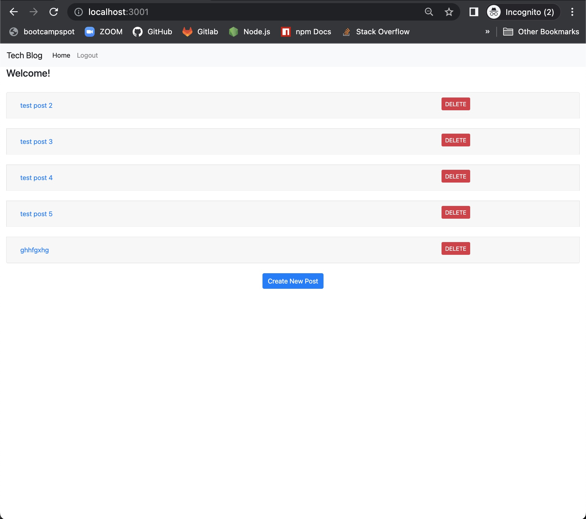
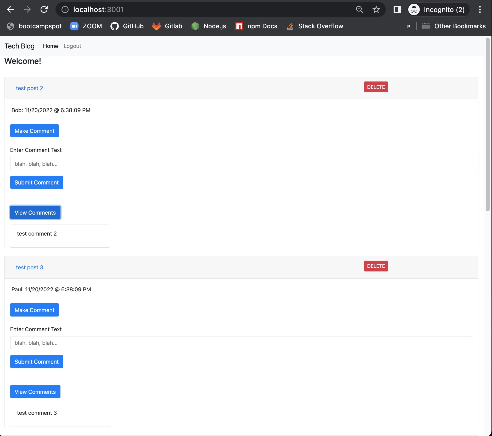
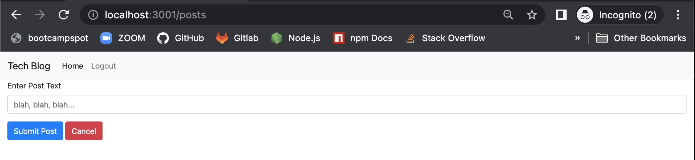

# m14c-MVC-tech_blog
# CMS-style blog site similar to a Wordpress site, where developers can publish their blog posts and comment on other developers’ posts as well.
# 
# Date: 20/11/2022, 12:23:50 pm

Links:

[github repo url: https://github.com/PatrickARatcliff/m14c-MVC-tech_blog](https://github.com/PatrickARatcliff/m14c-MVC-tech_blog)

[github pages deployed url: https://patrickaratcliff.github.io/m14c-MVC-tech_blog/](hhttps://patrickaratcliff.github.io/m14c-MVC-tech_blog/)

[heroku deployed url: https://m14c-mvc-techblog.herokuapp.com/](https://m14c-mvc-techblog.herokuapp.com/)

Screenshots:

  
## Table of Contents
- [Project Description](#project-description)
- [Installation Instructions](#installation-instructions)
- [Usage Information](#usage-information)
- [Contribution Guidelines](#contribution-guidelines)
- [Test Instructions](#test-instructions)
- [License](#license)
  
## Project Description
- CMS-style blog site similar to a Wordpress site, where developers can publish their blog posts and comment on other developers’ posts as well. Follows the MVC paradigm in its architectural structure, using Handlebars.js as the templating language, Sequelize as the ORM, and the express-session npm package for authentication.
  
## Installation Instructions
- To install, fork the repo, clone to your local repository, edit the ".env.EXAMPLE" file to include your SQL username and password. Rename the ".env.EXAMPLE" file to ".env". In your terminal/bash cd to the local repo and run the command: 

        npm i 

- Login to mySQL via command: 

        mysql -u 'your username' -p'your password' 

- Then run the commands:

        source db/schema.sql
        exit 

- Next, run the commands: 

        npm run seed
        npm start 

A window should automatically open in your browser displaying the app (if not, navigate to http://localhost:3001/).
  
## Usage Information
- To use the app, either login with:

        email: patrickdev@hotmail.com
        password: password12345 

    OR navigate to the sign-up page and create your own account. 

- You will be redirected to the homepage and you will see "posts" and "comments" populated. To create a new post, simply click the "Create New Post" button at the bottom of the page. You will be directed to a page where you can input your post text, submit or cancel. When finished you wwill be redirected to the homepage. To comment on a post simpky click the "Make Comment" button under the relevant post and a form will appear where you can enter the comment text, to finish click the "Submit Comment" button. To delete one of your posts, click the "DELETE" button to the right of your post text (you can only delete your own posts). Your information will be saved via sequalize in your mySQL database.
  
## Contribution Guidelines
- To contribute to this project, fork the repository at ‘https://github.com/PatrickARatcliff/m14c-MVC-tech_blog',create a pull request with a description for the change and its location.
  
## Test Instructions
- N/A
    
## License
- MIT License
- m14c-MVC-tech_blog: CMS-style blog site similar to a Wordpress site, where developers can publish their blog posts and comment on other developers’ posts as well.
- Copyright (c) [2022] [Patrick Ratcliff]. All rights reserved.

    

      Permission is hereby granted, free of charge, to any person obtaining a copy
      of this software and associated documentation files (the "Software"), to deal
      in the Software without restriction, including without limitation the rights
      to use, copy, modify, merge, publish, distribute, sublicense, and/or sell
      copies of the Software, and to permit persons to whom the Software is
      furnished to do so, subject to the following conditions:

      The above copyright notice and this permission notice shall be included in all
      copies or substantial portions of the Software.

      THE SOFTWARE IS PROVIDED "AS IS", WITHOUT WARRANTY OF ANY KIND, EXPRESS OR
      IMPLIED, INCLUDING BUT NOT LIMITED TO THE WARRANTIES OF MERCHANTABILITY,
      FITNESS FOR A PARTICULAR PURPOSE AND NONINFRINGEMENT. IN NO EVENT SHALL THE
      AUTHORS OR COPYRIGHT HOLDERS BE LIABLE FOR ANY CLAIM, DAMAGES OR OTHER
      LIABILITY, WHETHER IN AN ACTION OF CONTRACT, TORT OR OTHERWISE, ARISING FROM,
      OUT OF OR IN CONNECTION WITH THE SOFTWARE OR THE USE OR OTHER DEALINGS IN THE
      SOFTWARE.

    
***[This is an external link to the MIT license](https://en.wikipedia.org/wiki/MIT_License)***
  
---
